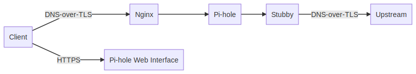

# Skyhole

Script to automatically set up a secure personal DNS-over-TLS server with blocking.

## Description

Pi-hole is a convenient DNS server that can block requests to unwanted domains through managed and custom lists. It comes with a web interface that provides insights about queries and management of the server.

This setup uses DNS-over-TLS to serve and forward DNS queries for more privacy. It also secures the web interface with HTTPS only.

## Components



|Component|Description|
|---|---|
|Nginx|Nginx creates a TLS proxy to serve DNS-over-TLS requests and send them to the Pi-hole DNS server.|
|Stubby|Stubby is used as the upstream DNS for Pi-hole so that queries from Pi-hole that it cannot answer are done using DNS-over-TLS.|
|Let's Encrypt|Let's Encrypt provides and automatically renews TLS certificates for the DNS-over-TLS server and Pi-hole web interface.|

## Server

### Prerequisites

- Server with a fresh install of Ubuntu 18.04 LTS.
  - This server must have a static IPv4 address within its local network.
  - It should also be connected to the Internet and be able to to send/receive over the ports listed below to/from anywhere.
- Domain name pointing to the IP address of the server.
  - This IP should not change.
- SSH access to the server.

#### Initial firewall rules

|Protocol|Port|Direction|Reason|
|---|---|---|---|
|TCP|22|In|Standard SSH for initial setup.|
|TCP|80|In|Let's Encrypt initial HTTP-01 challenge.|
|UDP, TCP|53|Out|Standard DNS queries for initial setup.|
|TCP|80, 443|Out|Standard outgoing HTTP requests for initial setup.|

### Install

SSH into the server and run the following commands on the server:

1. Clone this repo: `git clone https://github.com/wilsonzlin/skyhole.git`.
  - If git is not available, it's also possible to download the repo directly as an archive: `wget -qO - https://github.com/wilsonzlin/skyhole/archive/master.tar.gz | tar -xvz && mv skyhole-master skyhole`
2. Run the server script: `bash skyhole/server.sh --email YOUR_EMAIL --domain YOUR_DOMAIN`.
  - Replace `YOUR_EMAIL` and `YOUR_DOMAIN` with the appropriate values.
  - The email will be used by Let's Encrypt for [important communications](https://letsencrypt.org/docs/expiration-emails/).
  - See the full list of options below.
3. Enter the password to be set for the web interface of the Pi-hole.

#### Script options

|Name|Value|Description|
|---|---|---|
|`--email`|**Required**|Used by Let's Encrypt for [important communications](https://letsencrypt.org/docs/expiration-emails/).|
|`--domain`|**Required**|Domain name of the server e.g. `pihole.mywebsite.com`. This should resolve to the server's public IPv4 address.|
|`--password`||Password for the Pi-hole web interface. **If not provided, will be prompted for.**|
|`--ssh`|22|Port to listen on for the SSH service.|
|`--https`|443|Port to listen on for the Pi-hole web interface over HTTPS.|
|`--dot`|853|Port to listen on for the DNS-over-TLS Nginx proxy.|
|`--incoming`|0.0.0.0/0|What IPv4 address range to allow connections from on the SSH, HTTPS, and DNS-over-TLS ports.|

#### Normal operation firewall rules

|Protocol|Port|Direction|Reason|
|---|---|---|---|
|TCP|80|In|Let's Encrypt renewals.|
|TCP|`--dot`|In|DNS-over-TLS server.|
|TCP|`--https`|In|Pi-hole web interface over HTTPS.|
|TCP|`--ssh`|In (optional)|SSH access.|
|TCP|80, 443|Out|Standard outgoing HTTP requests for Let's Encrypt renewals.|
|TCP|853|Out|Upstream DNS-over-TLS via Stubby.|

### Usage

- See the web interface at `https://YOUR_DOMAIN/admin` and sign in with the password set during installation.
- Set your clients to use the server as their DNS resolver using DNS-over-TLS. See [Client](#Client) for details.

## Client

### Windows, macOS, Linux

Set up [Stubby](https://dnsprivacy.org/wiki/display/DP/DNS+Privacy+Daemon+-+Stubby) with the following value for `upstream_recursive_servers` (replace/comment any existing settings):

```yaml
upstream_recursive_servers:
  - address_data: YOUR_SERVER_IPV4_ADDRESS
    tls_auth_name: "YOUR_DOMAIN (quoted)"
```

### Android 9 and higher

1. Go to Settings → Network & internet → Advanced → Private DNS.
1. Select the Private DNS provider hostname option.
1. Enter `YOUR_DOMAIN` and hit Save.
