# Pi-hole

Pi-hole is a convenient DNS server that can block requests to unwanted domains through managed and custom lists. It comes with a web interface that provides insights about queries and management of the server.

This setup uses DNS-over-TLS to serve and forward DNS queries for more privacy. It also secures the web interface with HTTPS only.

## Components



### Nginx

Nginx creates a TLS proxy to serve DNS-over-TLS requests and send them to the Pi-hole DNS server.

### Stubby

Stubby is used as the upstream DNS for Pi-hole so that queries from Pi-hole that it cannot answer are done using DNS-over-TLS.

### Let's Encrypt

Let's Encrypt provides and automatically renews TLS certificates for the DNS-over-TLS server and Pi-hole web interface.

## Server

### Prerequisites

- Server with a fresh install of Ubuntu 18.04 LTS.
  - This server must have a static IPv4 address within its local network.
  - It should also be connected to the Internet, and be able to communicate on ports 443 and 853 incoming and outgoing.
- Domain name pointing to the IP address of the server.
  - This IP should not change.
- SSH access to the server.

### Install

SSH into the server and run the following commands on the server:

1. Clone this repo: `git clone https://github.com/wilsonzlin/nf.git`.
2. Run the server script: `nf/pi-hole/server.sh --email YOUR_EMAIL --domain YOUR_DOMAIN`.
  - Replace `YOUR_EMAIL` and `YOUR_DOMAIN` with the appropriate values.
  - The email will be used by Let's Encrypt for [important communications](https://letsencrypt.org/docs/expiration-emails/).
3. Enter the password to be set for the web interface of the Pi-hole.

### Usage

- See the web interface at `https://YOUR_DOMAIN/admin` and sign in with the password set during installation.

## Client

### Windows, macOS, Linux

Set up [Stubby](https://dnsprivacy.org/wiki/display/DP/DNS+Privacy+Daemon+-+Stubby) with the following value for `upstream_recursive_servers` (replace/comment any existing settings):

```yaml
upstream_recursive_servers:
  - address_data: YOUR_SERVER_IPV4_ADDRESS
    tls_auth_name: "YOUR_DOMAIN (quoted)"
```

### Android 9 and higher

1. Go to Settings → Network & internet → Advanced → Private DNS.
1. Select the Private DNS provider hostname option.
1. Enter `YOUR_DOMAIN` and hit Save.
